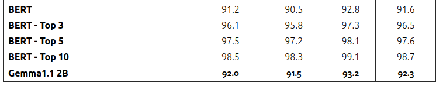
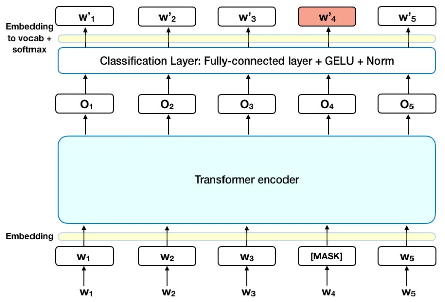
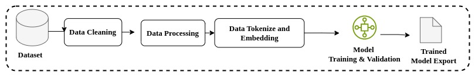

# Project Documents

This project focuses on developing a machine learning model to classify resumes into predefined categories using a BERT-based neural network. By leveraging the rich contextual embeddings provided by a pre-trained BERT model, the project aims to accurately identify the domain or category of a given resume, such as engineering, finance, healthcare, etc.


## Table of Contents

- [Resume Categorization](#project-documents)
  - [Table of Contents](#table-of-contents)
  - [Related work](#related-work-and-research-paper-analysis)
  - [Model](#model)
    - [Reason Behid Choosing BERT Architecture]()
  - [Training Pipeline](#training-pipeline)
  

## Related Work and Research Paper Analysis


I conducted an extensive analysis of various research papers and related work in the field of Natural Language Processing (NLP) for the Resume Categorization. Through this review, I identified several key findings and insights that contribute to our understanding and development of NLP techniques for Categorization. Below, I present the most significant findings from my analysis from some papers.


- [**ResuméAtlas: Revisiting Resume Classification with Large-Scale Datasets and Large Language Models**](https://arxiv.org/html/2406.18125v1)
  - Curated a large-scale dataset of 13,389 resumes from diverse sources and employed Large Language Models (LLMs) such as BERT and Gemma1.1 2B for classification
  - Our results demonstrate significant improvements over traditional machine learning approaches, with our best model achieving a top-1 accuracy of 92% and a top-5 accuracy of 97.5%



- [**Comparative Analysis of ML (Machine Learning) and LLM (Large Language Models) in Resume Parsing: A Paradigm Shift in Talent Acquisition**](https://www.researchgate.net/publication/378698002_Comparative_Analysis_of_ML_Machine_Learning_and_LLM_Large_Language_Models_in_Resume_Parsing_A_Paradigm_Shift_in_Talent_Acquisition)
  - Equipped with both MachineLearning and OCR, shows amarked improvement in parsing capability.It records an FN of 25.94, a precision of0.80 (or 80%), a recall of 67%, and an F1score of 0.72
  -  LLM, NLP & OCR showsoutstanding performance. It has an FN of1.144, indicating very few missed fields.The precision is high at 0.94 (or 94%), andthe recall is exceptionally high at 93.91%,leading to an F1 score of 0.94.

- [**Resume Classification using various Machine Learning Algorithms**](https://www.itm-conferences.org/articles/itmconf/pdf/2022/04/itmconf_icacc2022_03011.pdf)

| Algorithm      | Accuracy | Precision | Recall | F1 Score |
| -------------- | -------- | --------- | ------ | -------- |
| Naïve Bayes    | 45       | 0.521     | 0.452  | 0.448    |
| SVM            | 60       | 0.598     | 0.597  | 0.594    |
| Random Forest  | 70       | 0.687     | 0.683  | 0.678    |

- [**Resume Classification Using ML Techniques**](https://www.itm-conferences.org/articles/itmconf/pdf/2022/04/itmconf_icacc2022_03011.pdf)

## Model
The model is built using a pre-trained BERT model (bert-base-uncased) integrated into a custom neural network architecture for the resume classification task. The architecture includes:




- **Model**: Extracts contextual embeddings from the resume text.
- **Intermediate Linear Layer:** Transforms the BERT output into a feature space of 512 dimensions.
- **Dropout Layer:** Applies dropout regularization with a probability of 0.3 to prevent overfitting.
- **Output Linear Layer:** Maps the transformed features to the desired number of output classes.

## Reason Behind Choosing the BERT Model
After thoroughly analyzing various research papers, we considered three potential approaches for our model selection:
- **Transformer-based LLM Models**: Such as BERT,RoBERTa,T5
- **LSTM-based or Hybrid Models**: Including LSTM, LSTM-CNN, BLSTM-CNN, and BLSTM-CRF.
- **Stochastic Methods**: Such as SVM,Decision Tree,Ramdom Forest.

### Why BERT?
- **Contextual Understanding of Language:**: BERT (Bidirectional Encoder Representations from Transformers) is designed to understand the context of words in a sentence.BERT looks at the entire sentence from both directions (left-to-right and right-to-left) to build a deep understanding of how each word relates to the others
- **Performance Comparison**: The performance gap between Transformer-based LLMs and other traditionalmodel is relatively High.

- **Dataset Nature**: Resumes often contain long and complex sequences of text. BERT is well-suited to handle these long sequences because it can process and maintain attention across all tokens in the sequence simultaneously, ensuring that important information from different parts of the resume is not lost.

## Training Pipeline
The model training pipeline involves several key steps: data cleaning to remove errors and inconsistencies, data processing to prepare and structure the data, tokenization and embedding to convert text into numerical representations, training the model using the prepared data, and evaluating the model's performance using various metrics.



      


#### Datasets
We provide a dataset named ```Resume.csv`` , and the dataset format is as follows:
```bash
<ID>  <Resume>  <Resume_HTML> <Category>
```
We have also directory wise Resume pdf in separate folder
#### Data Cleaning and Processing
Data cleaning for resume categorization prepares raw resume data for effective model training by normalizing text, tokenizing content, removing irrelevant information, handling missing values, encoding labels, and potentially augmenting data. This process ensures data consistency and quality, enabling the model to accurately classify resumes into categories, such as job domains, by resolving issues like noisy data, inconsistent formats, and incomplete entries.

| Category             | Count |
| --------------------- | ----- |
| INFORMATION-TECHNOLOGY | 120   |
| BUSINESS-DEVELOPMENT  | 120   |
| FINANCE               | 118   |
| ADVOCATE              | 118   |
| ACCOUNTANT            | 118   |
| ENGINEERING           | 118   |
| CHEF                  | 118   |
| AVIATION              | 117   |
| FITNESS               | 117   |
| SALES                 | 116   |
| BANKING               | 115   |
| HEALTHCARE            | 115   |
| CONSULTANT            | 115   |
| CONSTRUCTION          | 112   |
| PUBLIC-RELATIONS      | 111   |
| HR                    | 110   |
| DESIGNER              | 107   |
| ARTS                  | 103   |
| TEACHER               | 102   |
| APPAREL               | 97    |
| DIGITAL-MEDIA         | 96    |
| AGRICULTURE           | 63    |
| AUTOMOBILE            | 36    |
| BPO                   | 22    |

After analyzing the dataset categories, we found that our dataset is imbalanced. To address this issue, we performed data augmentation. Additionally, we used the BERT tokenizer for text processing and embedded our data accordingly.

#### Model Training and Evaluation
This Processing trains a BERT-based resume classifier model. It includes setting up the optimizer and loss function with L2 regularization, scheduling learning rate adjustments, and implementing early stopping to prevent overfitting. It tracks training and validation accuracy, saves the best model based on validation performance, and prints progress updates during each epoch. The results include training accuracy, validation accuracy, and loss metrics.


#### Trained Model Export 
Once the model is trained, it needs to be exported for future use. The export can be done in various formats, including `.pt, .pth, .onnx, & .bin.` Depending on the requirements, we have the flexibility to save either the entire model or just the weights. The choice of format and what to save depends on the specific needs of subsequent operations.

